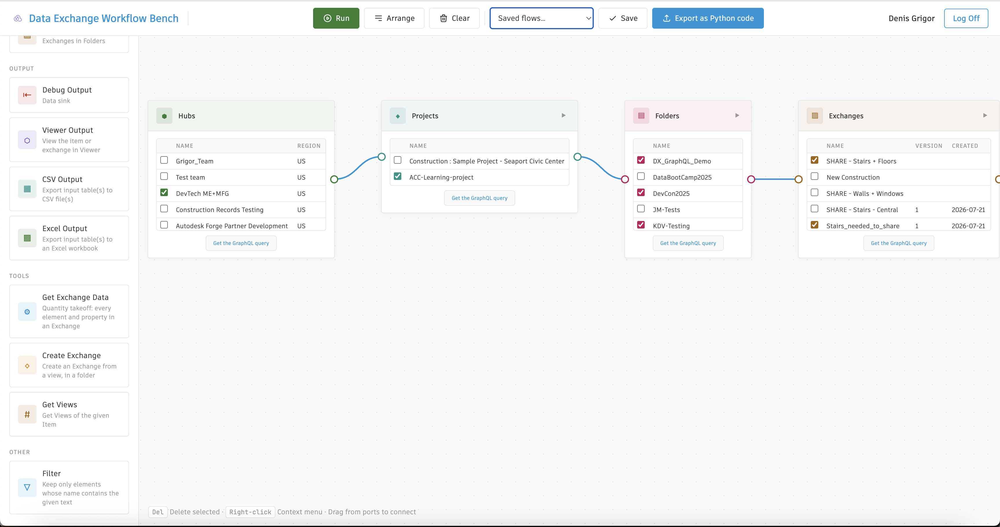

# Data Exchange Workflow Bench

[](https://www.python.org/)
[](https://www.python.org/dev/peps/pep-0008/)

[](https://stackoverflow.com/questions/ask?tags=%5bautodesk-aps)
[](http://opensource.org/licenses/MIT)

## Description

This is a Python sample built as a visual dataflow editor: drag nodes onto a canvas, wire them together, and run the graph against the Autodesk Platform Services (APS) Data Exchange GraphQL API. The code is organized so each node type maps clearly to the query it runs — readability and comprehension come first, not compactness.

Built as a Flask app with APS 3-legged sign-in. For project structure, node types, how to read the code, and extending the app, see [other_info.md](./other_info.md).

## Thumbnail



### Dependencies

- **Python**: Download [Python](https://www.python.org/downloads/). **It is required to use Python >= 3.13** (see `pyproject.toml`).
- **[uv](https://docs.astral.sh/uv/)**: Used to install dependencies and run the app (`uv sync`, `uv run`).
- **APS Account**: Learn how to create an APS Account, activate subscription and create an app at [this tutorial](https://tutorials.autodesk.io/#create-an-account).


## Running locally

Data Exchange calls require a 3-legged authenticated token. Unlike the CLI sample, this app includes the full OAuth flow — sign in through the browser and the session stores the token for all `/api/dx/*` routes.

Create an app at [https://aps.autodesk.com/myapps](https://aps.autodesk.com/myapps) with a callback URL of `http://localhost:5000/oauth/callback` (or whatever you set `APS_REDIRECT_URI` to).

Within the project folder:

1. Install dependencies:

```commandline
    uv sync
```

1. Configure credentials:

```commandline
    cp .env.example .env
```

Edit `.env` and set `APS_CLIENT_ID` and `APS_CLIENT_SECRET`. Optional: adjust `APS_REDIRECT_URI`, `APS_SCOPE`, `PORT`, and `FLASK_SECRET_KEY`.

1. Start the app:

```commandline
    uv run python run.py
```

1. Open [http://localhost:5000/](http://localhost:5000/) in a browser. The landing page shows **Sign In with Autodesk** until you have a session; once signed in, the flow editor opens at `/`. Use **Log Off** to return to the landing page.

Each API-backed node has a **Get the GraphQL query** button that shows the query, example variables, and required headers. You can also export a flow as a standalone Python script from the toolbar (**Export as Python code**).

To deploy on Dokku, see [DEPLOY.md](./DEPLOY.md) (`Procfile`, `requirements.txt`, `runtime.txt`).

## Known issues

- Access tokens are not auto-refreshed; sessions expire after ~1 hour. If you add the `viewables:read` scope for Viewer Output, log in again after changing `APS_SCOPE`.


## Further Reading

- [Deploying to Dokku (Python buildpack)](./DEPLOY.md)
- [APS Data Exchange GraphQL tutorial](https://autodesk-platform-services.github.io/aps-dx-graphql-tutorial/)
- [Detailed documentation for this sample](./other_info.md) — project layout, reading guide, node types, adding/removing nodes
- [Blog post "Creating Data Exchanges using GraphQL API"](https://aps.autodesk.com/blog/creating-data-exchanges-using-graphql-api)


## License

These samples are licensed under the terms of the [MIT License](http://opensource.org/licenses/MIT). Please see the [LICENSE](LICENSE) file for full details.

### Authors

Denis Grigor ([denis.grigor@autodesk.com](denis.grigor@autodesk.com)), [APS Partner Development](http://aps.autodesk.com)

See more at [Developer Community Blog](https://aps.autodesk.com/blog).
