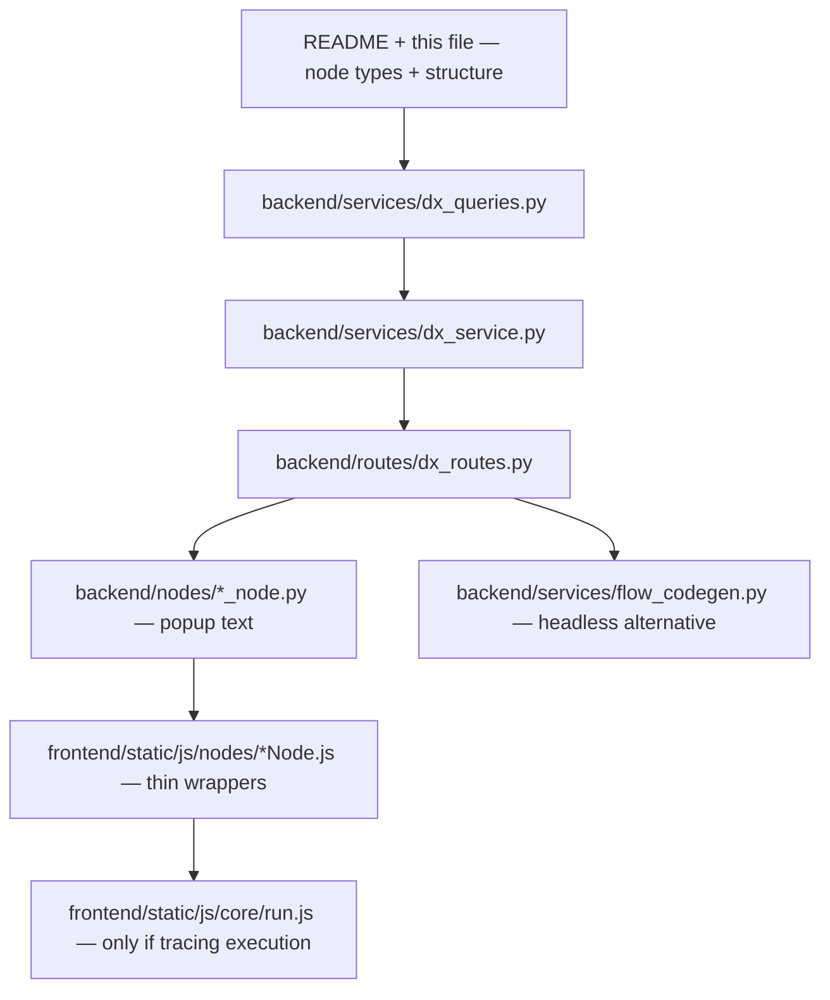

# Data Exchange Workflow Bench — additional documentation

This file supplements [README.md](./README.md) with project structure, a code-reading guide, node types, and extension notes.

## Project structure

```
backend/                  Flask application
├── __init__.py           App factory (create_app)
├── routes/                HTTP endpoints (blueprints)
│   ├── auth_routes.py     APS 3-legged OAuth: /oauth/login, /oauth/callback, /oauth/logout
│   ├── main_routes.py     '/' - landing page when signed out, editor when signed in
│   ├── flow_routes.py     /api/flows/* CRUD + /api/flows/export-script (login-gated)
│   └── dx_routes.py       /api/dx/* - runs the queries in dx_queries.py against the APS Data Exchange API
├── services/               Business logic
│   ├── auth_service.py    Builds authorize URL, exchanges code, fetches profile
│   ├── flow_service.py    Reads/writes flow JSON files under data/flows/
│   ├── dx_service.py      Executes one GraphQL request against the APS Data Exchange API
│   ├── dx_queries.py      Raw GraphQL query text, shared by dx_routes.py and flow_codegen.py
│   └── flow_codegen.py    Generates the standalone Python script behind the toolbar's "Export" button
├── nodes/                  Node type library (canonical metadata)
│   ├── base.py            NodeType dataclass
│   └── *_node.py          One module per node type

frontend/
├── templates/
│   ├── landing.html       Signed-out welcome page with a Sign In CTA
│   └── index.html         The editor, node palette rendered from backend/nodes/
└── static/
    ├── css/                Color scheme ported from aps-medm-navigator-python
    └── js/
        ├── core/           Canvas engine: state, connections, ports, run, save/load
        └── nodes/          One ES module per node type (mirrors backend/nodes/)

data/flows/                 Saved flows, one JSON file per flow
```

The Python `backend/nodes/` package is the single source of truth for each
node type's name, icon, accent color, ports, default field values, and (for
API-backed node types) the query text shown by its "Get the GraphQL query"
popup. That metadata is injected into the page as JSON (`#node-types-data`)
and consumed by the matching `frontend/static/js/nodes/*.js` module, which
implements the type's actual canvas behavior (config UI, execution).

## How to read this codebase

This app is a **visual wrapper around the APS Data Exchange GraphQL API**.
The canvas, connections, and Run button are orchestration; the API story lives
in a small set of backend files. If your goal is to understand how Data
Exchange queries work, start there — treat the frontend as "what triggers the
call" rather than "where the API logic lives".



### The GraphQL learning spine

| Layer | File | What to look for |
|-------|------|------------------|
| **Queries** | `backend/services/dx_queries.py` | Raw GraphQL sent over the wire — one constant per API operation |
| **Transport** | `backend/services/dx_service.py` | Single POST helper: `Authorization`, `Region` header, partial-error handling |
| **Orchestration** | `backend/routes/dx_routes.py` | One route per API-backed node; pagination loops; how upstream selections become variables |
| **Teaching copy** | `backend/nodes/*_node.py` | `graphql_query_text` for the "Get the GraphQL query" popup (Variables + Headers included) |
| **UI trigger** | `frontend/static/js/nodes/*Node.js` | Thin wrappers: table UI + `fetch('/api/dx/...')` |
| **Flow engine** | `frontend/static/js/core/run.js` | Wires nodes together; special cases for multi-input nodes — **not** where GraphQL lives |
| **Headless replay** | `backend/services/flow_codegen.py` | Exports the full flow as a standalone Python script (GraphQL + REST + CSV/Excel) |

`config.py` holds the GraphQL endpoint URL and OAuth settings. `auth_routes.py` /
`auth_service.py` get you a 3-legged token; every `/api/dx/*` route reads it
from the session.

### Recommended reading order

1. **Skim [Node types](#node-types) below** — know what each block on the canvas represents in APS terms (hub, project, folder, exchange, …).
2. **Read `dx_queries.py` top to bottom** — this is the canonical query list.
   Comments explain pagination and which query serves which node.
3. **Read `dx_service.py`** — one function, ~50 lines; shows exactly how a
   query is POSTed (headers, JSON body, when errors are raised).
4. **Read `dx_routes.py` with its section map** — the file opens with a
   table-of-contents comment. Focus first on the "browse the hierarchy" routes
   (`/hubs` → `/projects` → `/folders` → `/items` → `/exchanges`), then
   `/exchange-data` and `/create-exchange` if you care about filtering or
   mutations.
5. **Open one node's backend + frontend pair** — e.g. `folders_node.py` and
   `foldersNode.js`. Navigation nodes share logic via
   `selectableProjectFedTable.js`; each `*Node.js` file is mostly wiring.
6. **Only then read `run.js`** — if you need to understand multi-input
   aggregation (Viewer Output, Create Exchange, Filter, Get Exchange Data) or
   why a Filter upstream skips a re-fetch (`skipFetch`).
7. **Optional: export a flow** — the toolbar's "Export as Python code" button
   runs `flow_codegen.py` and gives you the same GraphQL pipeline without the
   browser.

### Tracing one node end-to-end

Pick any API-backed node and follow the same path. Example — **Folders**:

| Step | Where | What happens |
|------|-------|--------------|
| 1 | Canvas | User connects Projects → Folders and clicks Run |
| 2 | `run.js` | Resolves upstream checkbox selection, calls `foldersNode.execute()` |
| 3 | `foldersNode.js` | `POST /api/dx/folders` with `{ projects: [{ id, region, kind }, …] }` |
| 4 | `dx_routes.py` → `folders()` | `_aggregate_folder_contents()` runs `GET_FOLDER_FOLDERS_QUERY` per folder, follows pagination |
| 5 | `dx_service.py` | POSTs query + `Region` header to the GraphQL endpoint |
| 6 | `dx_queries.py` | `GET_FOLDER_FOLDERS_QUERY` is the actual query text |

The **"Get the GraphQL query"** button on the node shows the teaching copy from
`folders_node.py` (`graphql_query_text`), including example Variables and the
`Region` header — things the raw query constant alone does not spell out.

### Internal keys vs display names

Several nodes use legacy internal `key` values that differ from their palette
name. When searching the code, use the **key**:

| Palette name | Internal `key` | Backend module |
|--------------|----------------|----------------|
| Hubs | `hubs` | `hubs_node.py` |
| Projects | `projects` | `projects_node.py` |
| Folders | `folders` | `folders_node.py` |
| Items | `items` | `items_node.py` |
| Exchanges | `exchanges` | `exchanges_node.py` |
| Get Exchange Data | `process` | `exchange_data_node.py` |
| Debug Output | `output` | `output_node.py` |
| Create Exchange | `logic` | `create_exchange_node.py` |
| Viewer Output | `data` | `viewer_output_node.py` |
| Get Views | `get_views` | `get_views_node.py` |
| Filter | `filter` | `filter_node.py` |

### Two copies of each GraphQL query

Query text appears in **two places** on purpose:

- **`dx_queries.py`** — what the server actually sends.
- **`backend/nodes/*_node.py`** → `graphql_query_text` — what the popup shows,
  with comments, example Variables, and Headers.

They are kept separate so each node type stays independently editable without
accidentally changing another node's popup. When in doubt, **`dx_queries.py`
is authoritative for runtime behavior**.

### Payload naming quirks

Several `/api/dx/*` routes accept a JSON field named `projects` even when the
upstream selection is folders or exchanges. That field means **"the list of
upstream items to query"** — each entry carries `id`, `region`, and optionally
`kind` (`project` vs `folder`) so the backend knows whether to resolve a
project's "Project Files" folder or treat the id as an already-resolved folder.
See `_resolve_folder_id()` in `dx_routes.py`.

### Not everything is GraphQL

Most navigation and data nodes use the Data Exchange GraphQL API, but two paths
use other APS REST APIs — both are documented in code with links to the
official tutorial:

| Node | API | Where |
|------|-----|-------|
| **Get Views** | Data Management + Model Derivative | `model_derivative_service.py` |
| **Viewer Output** | Autodesk Viewer SDK (uses session token via `/api/dx/viewer-token`) | `viewerOutputNode.js`, `viewerSdk.js` |

**Filter** does not call the API at all — it narrows an already-fetched list
client-side by name. When Filter feeds Folders/Items/Exchanges, those nodes
skip their own query (`skipFetch` in `selectableProjectFedTable.js`).

### Canonical data-flow story (GraphQL)

The main "browse and query" pipeline the sample is built around:

```
Hubs  →  Projects  →  Folders / Items / Exchanges  →  Get Exchange Data
  │          │                    │                           │
GetHubs  GetProjects    GetFolderContent (×3)      FilterUsingComplexQuery
```

- **Region** flows downstream: each hub's region is copied onto its projects,
  then onto folder/item/exchange results, so later routes can set the correct
  `Region` header without re-querying the hub.
- **Pagination** is followed in `_aggregate_folder_contents()` (folders/items/
  exchanges) and `_fetch_exchange_elements()` (exchange elements) — a folder
  or exchange with more than 200 children is not silently truncated to one page.

## Node types

- **Hubs** fetches the signed-in user's APS hubs as soon as the node is
  created and displays them in a checkbox-selectable Name/Region table. Its
  output is always "live" - it's just the current checkbox selection, no Run
  needed.
- **Projects**, **Folders**, **Items**, **Exchanges** each run their own
  GraphQL query (see their "Get the GraphQL query" button) against whatever
  came from the node upstream, and again expose a checkbox-selectable table
  as their output. Folders/Items/Exchanges accept either a Project or an
  already-resolved Folder as input (e.g. chaining Folders → Folders to drill
  into a subfolder).
- **Get Exchange Data** (`process` in code, lives in `exchange_data_node.py`/
  `exchangeDataNode.js`) runs `FilterUsingComplexQuery` server-side for each
  connected Exchange, optionally narrowed by an RSQL filter string, and
  flattens elements/properties into a quantity-takeoff table.
- **Debug Output** (`output`) is a simple data sink - it just displays
  whatever its input currently is.
- **Viewer Output** (`data`) embeds a headless Autodesk Viewer and renders
  whichever Exchange/Item element is selected (a dropdown appears if more
  than one is connected).
- **Create Exchange** (`logic`) runs the `createExchange` mutation once per
  selected view (from Get Views) into a destination folder — see
  `create_exchange_node.py` and `/api/dx/create-exchange`.
- **CSV Output**/**Excel Output** (`csv_output`/`excel_output`) accept any
  number of connected table-producing nodes (Items, Exchanges, Folders, Get
  Views, or a Filter narrowing one of those) and **download** their rows
  through the browser — one CSV (or ZIP of CSVs when column shapes differ) /
  one XLSX workbook per run. An optional filename field sets the suggested
  download name (defaults to `<node id>.csv`/`.xlsx` when left blank).

## Adding or removing a node type

A node type has a backend half (metadata + optional API route) and a
frontend half (canvas rendering + execution) that mirror each other by
`key` - easy to get out of sync by hand (a forgotten registration, or a
`key` that doesn't match on each side), and both failure modes fail
silently until you actually try to use the node. Use the scripts instead of
editing `backend/nodes/__init__.py` / `frontend/static/js/nodes/registry.js`
by hand:

```bash
uv run python scripts/new_node.py            # add a node type
uv run python scripts/remove_node.py [key]   # remove one
```

`new_node.py` asks a few questions (key, name, icon, description, accent,
ports, whether it needs the "Get the GraphQL query" popup, whether it needs
richer execution semantics) and generates + registers both halves
consistently, then sanity-checks the result (backend imports cleanly, valid
JS syntax).

`remove_node.py` does the reverse - run it with no argument and it lists
node types to pick from by number, or pass a key directly. It refuses to
touch Hubs, Projects, Folders, Items, Exchanges, Debug Output, or Viewer
Output (the app doesn't make sense without those). The picker only lists
genuinely custom node types - Exchange Data and Create Exchange shipped
with the app too, so they're left out of the list (pass `process` or
`logic` explicitly if you really want to remove one of those). Either way,
it backs up whatever it's about to delete under
`scripts/.removed_node_backups/` first (this repo isn't under version
control, so that's the only undo available), and warns if any saved flow
under `data/flows/` still references the node type you're removing.

A few things worth knowing when answering the scripts' questions:

- **Execution**: `run.js` automatically calls a new node type's
  `execute(nodeId, nodeData, value)` with its single input's value - this
  covers most node types. Only Exchange Data (multiple simultaneous inputs)
  and Viewer Output (multiple connections into one port) need their own
  hand-written dispatch in `frontend/static/js/core/run.js`; if you say your
  node needs something like that, `new_node.py` won't generate an
  `execute()` for you (a wrong one is worse than none), and you'll need to
  extend `run.js` yourself.
- **Styling** is optional - nodes look fine with zero CSS. `accent` just
  needs to be one of the 9 existing names in `variables.css` (`primary`,
  `success`, `tertiary`, `warning`, `info`, `teal`, `magenta`, `slate`,
  `gold`) to get a matching palette icon/header/port color for free.
- **Connection restrictions** are opt-in via `allowed_source_types` on the
  `NodeType` (a list of upstream node type keys) - e.g. Folders/Items/
  Exchanges only accept a Project or another Folder, and Viewer Output only
  accepts an Exchange or an Item. Enforced generically in
  `frontend/static/js/core/connections.js`'s `endConnection()`; leave it
  empty (the default) for a node that should accept input from anything.
- The **"Get the GraphQL query" popup** is opt-in (`graphql_query_text` on
  the `NodeType`) - only relevant for nodes that call the Data Exchange API
  directly.
- The toolbar's **"Export as Python code"** button generates a standalone
  script via `flow_codegen.py` for all node types used in the reference
  workflows (`data/flows/`): navigation nodes, Get Views, Create Exchange,
  Get Exchange Data, Filter, CSV/Excel Output, and Debug Output. Viewer
  Output prints connected exchange JSON instead of loading the Viewer SDK.
  New custom node types still need their own codegen support unless they
  follow the generic single-input `execute()` pattern.
